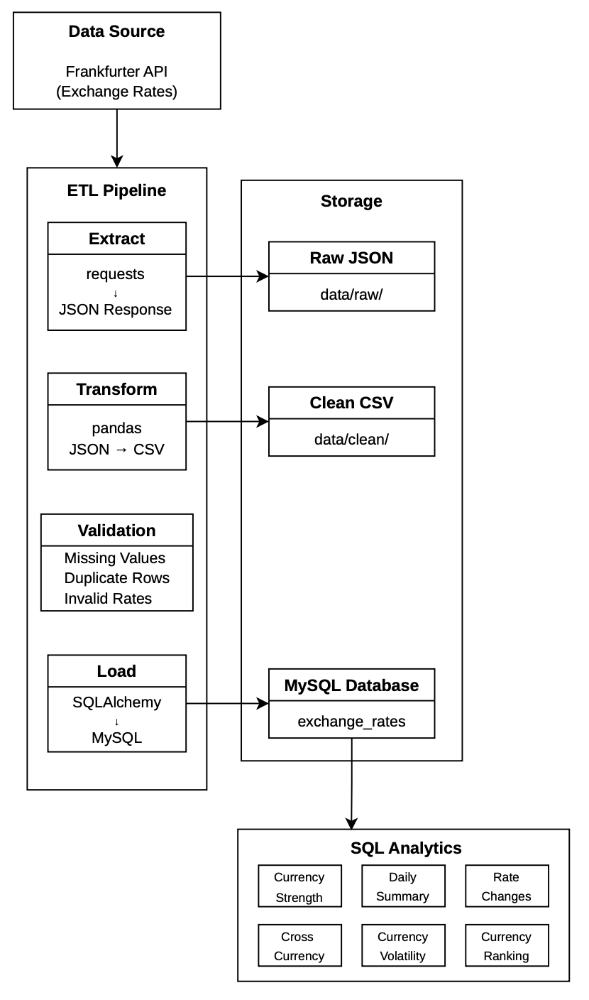
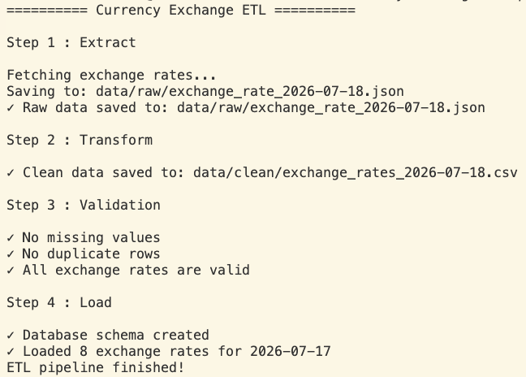
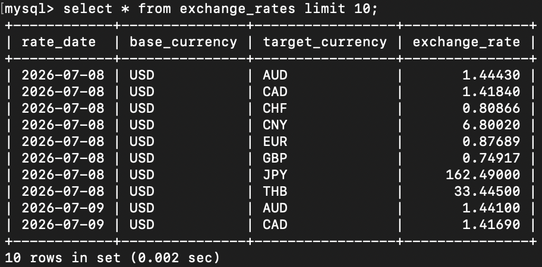
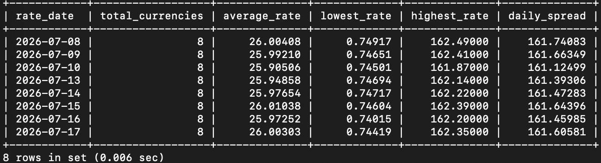
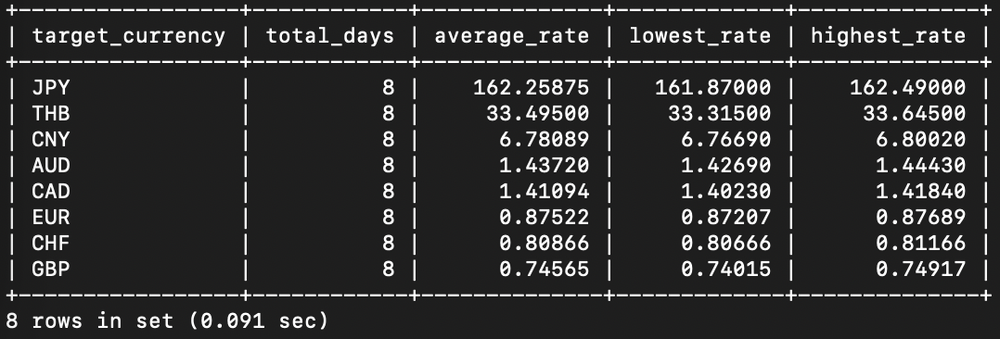
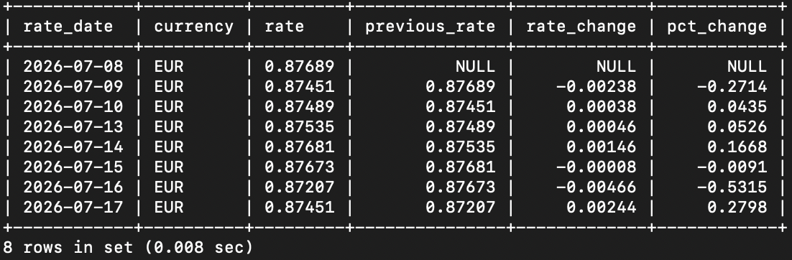
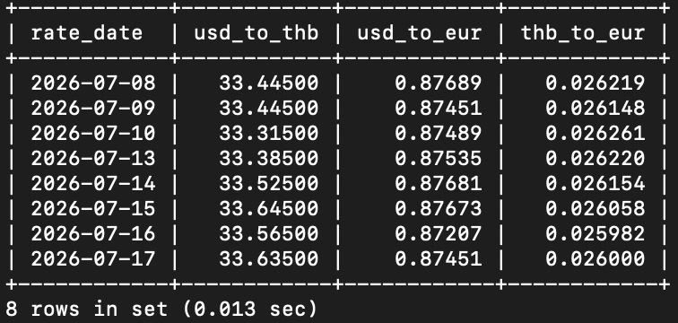
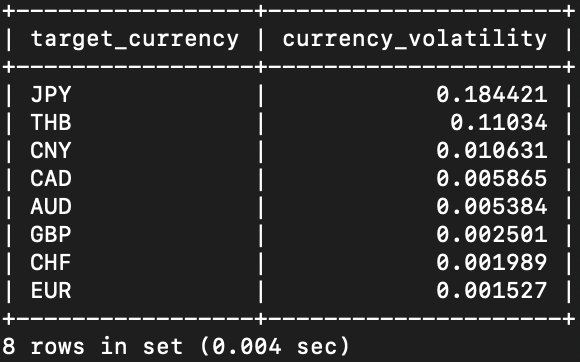
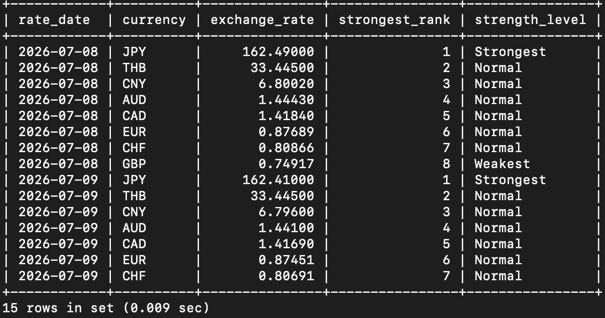

# Currency Exchange ETL Pipeline


A complete ETL (Extract, Transform, Load) pipeline that collects daily exchange rates from the Frankfurter API, validates and stores the data in MySQL, and performs SQL analytics for reporting and trend analysis.

---

## Project Overview

This project demonstrates a complete ETL workflow built with Python and MySQL for collecting, validating, storing, and analyzing foreign exchange rate data.

The pipeline performs the following tasks:

- Extract daily exchange rates from the Frankfurter API
- Store the raw API response as JSON
- Transform JSON into a clean tabular format (CSV)
- Validate data quality
- Load cleaned data into MySQL
- Prevent duplicate data loading
- Support historical backfill
- Analyze exchange rates using SQL

---

## Features

- Daily exchange rate extraction
- Historical backfill support
- JSON → CSV transformation
- Data validation
    - Missing values
    - Duplicate rows
    - Invalid exchange rates
- MySQL integration
- Idempotent data loading (prevents duplicate records)
- SQL analytics queries
- Logging

---

## Architecture Diagram

<p align="left">
   </p>

---

## Tech Stack

### Programming Language

- Python 3.11

### Libraries

- pandas
- requests
- SQLAlchemy
- PyMySQL
- python-dotenv

### Database

- MySQL

### Concepts

- ETL Pipeline
- Data Validation
- Data Cleaning
- Logging
- Window Functions
- SQL Analytics

--- 

## Data Source

Exchange rates are retrieved from the Frankfurter API.

- Base currency: USD
- Target currencies: THB, EUR, JPY, GBP, AUD, CAD, CHF, CNY

---

## Project Structure

```text
currency-exchange-etl-pipeline/
│
├── python/
│   ├── extract/
│   ├── transform/
│   ├── validation/
│   ├── load/
│   ├── backfill/
│   └── utils/
│
├── sql/
│   ├── schema.sql
│   ├── analytics/
│   └── validation/
│
├── data/
│   ├── raw/
│   └── clean/
│
├── logs/
│
├── requirements.txt
├── README.md
└── LICENSE
```

---

## ETL Workflow

```text
Frankfurter API
        │
        ▼
     Extract
        │
        ▼
    Raw JSON
        │
        ▼
    Transform
        │
        ▼
    Clean CSV
        │
        ▼
   Validation
        │
        ▼
      MySQL
        │
        ▼
 SQL Analytics
```

---

## SQL Analytics

The project contains analytical SQL queries that demonstrate aggregation, window functions, ranking, volatility analysis, and cross-currency calculations.

| File | Description |
|------|-------------|
| 01_currency_strength.sql | Average, minimum, and maximum exchange rates |
| 02_daily_summary.sql | Daily exchange rate summary |
| 03_rate_changes.sql | Daily exchange rate changes using window functions |
| 04_cross_currency.sql | Cross currency exchange calculations |
| 05_currency_volatility.sql | Exchange rate volatility using STDDEV |
| 06_currency_ranking.sql | Currency ranking using SQL window functions |

---

## Installation

Clone the repository.

```bash
git clone <repository-url>

cd currency-exchange-etl-pipeline
```

Create a virtual environment.

```bash
python -m venv .venv
```

Activate it.

```bash
source .venv/bin/activate
```

Install dependencies.

```bash
pip install -r requirements.txt
```

---

## Environment Variables

Create a `.env` file.

```text
DB_HOST=localhost
DB_PORT=3306
DB_NAME=currency_exchange
DB_USER=root
DB_PASSWORD=your_password
```

---

## Running the Pipeline

Run today's ETL.

```bash
python -m python.main
```

Run historical backfill.
Example:

```bash
python -m python.backfill.backfill --days 7
```

---

## Example Output

### ETL Pipeline

Example execution of the ETL pipeline, showing each stage from data extraction to loading into MySQL with validation checks.

<p align="left">
   </p>

### MySQL Database

Sample records loaded into the `exchange_rates` table after the ETL process has completed successfully.

<p align="left">
   </p>

### SQL Result Example (Daily Summary)

Example analytical query showing a daily exchange rate summary generated from the loaded dataset.

<p align="left">
   </p>

---

## SQL Analytics Examples

### 01 Currency Strength

Calculates the average, minimum, and maximum exchange rate for each currency across the available dates.

<p align="left">
   </p>

---

### 02 Daily Summary

Provides a daily overview of exchange rate statistics, including average, minimum, maximum, and daily spread.

<p align="left">
   </p>

---

### 03 Rate Changes

Calculates day-to-day exchange rate changes and percentage changes using the `LAG()` window function.

**Note:** Only EUR results are shown for readability.

<p align="left">
   </p>

---

### 04 Cross Currency

Computes the **THB → EUR** cross exchange rate using USD as the common base currency by joining exchange rates from the same date.

<p align="left">
   </p>

---

### 05 Currency Volatility

Measures exchange rate volatility for each currency using the standard deviation (`STDDEV`).

<p align="left">
   </p>

---

### 06 Currency Ranking

Ranks currencies by exchange rate for each day and classifies them as **Strongest**, **Weakest**, or **Normal** using SQL window functions.

**Note:** Only the first 15 rows are shown.

<p align="left">
  
</p>

---

## Future Improvements

- Docker support
- CI/CD pipeline
- Apache Airflow scheduling
- Unit testing
- Power BI / Tableau dashboard
- Cloud deployment
- Data warehouse integration

---

## License

MIT License