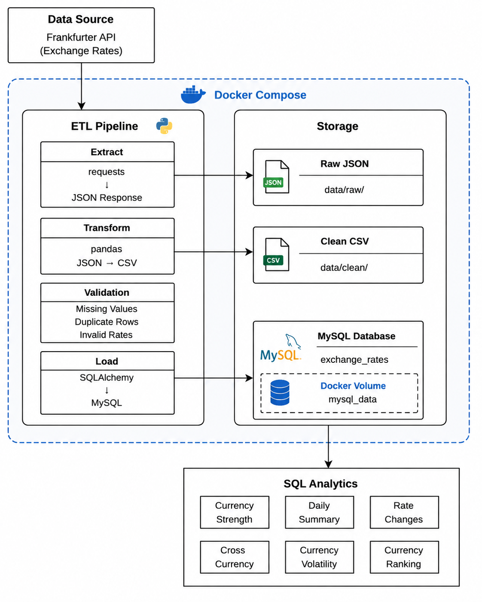
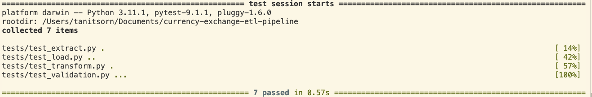
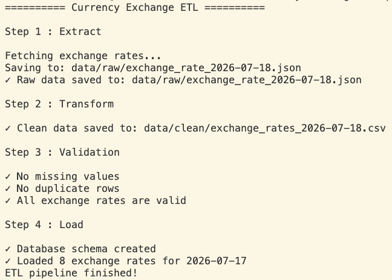
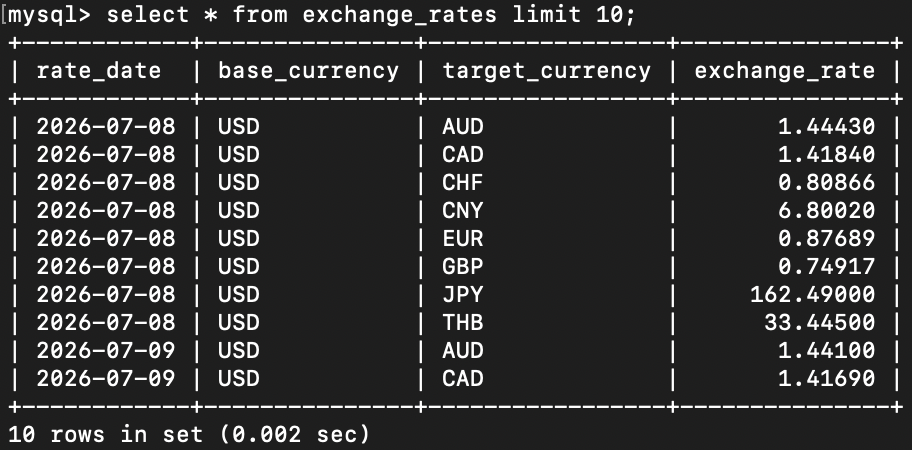
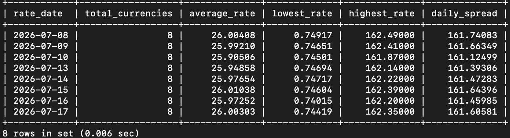
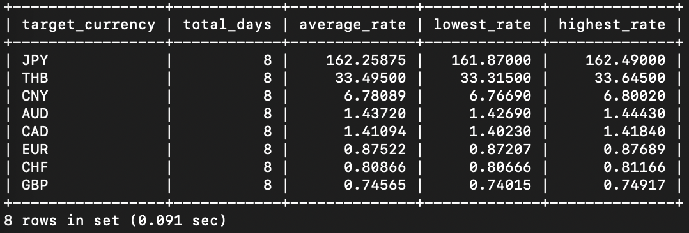
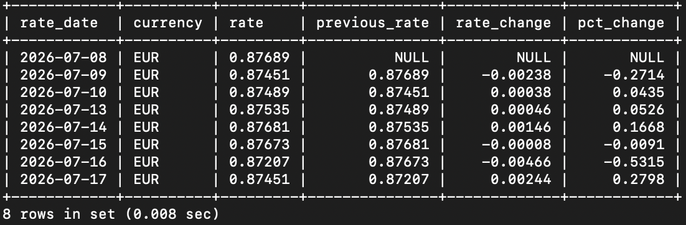
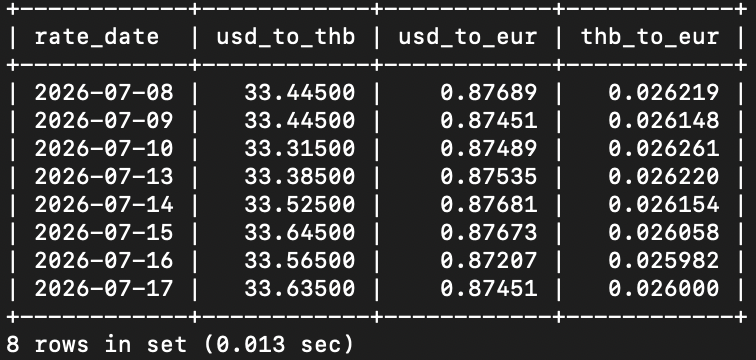
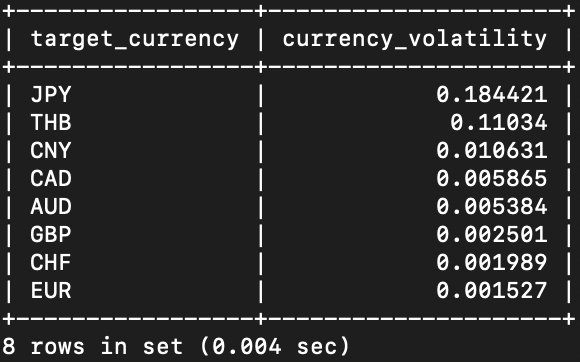
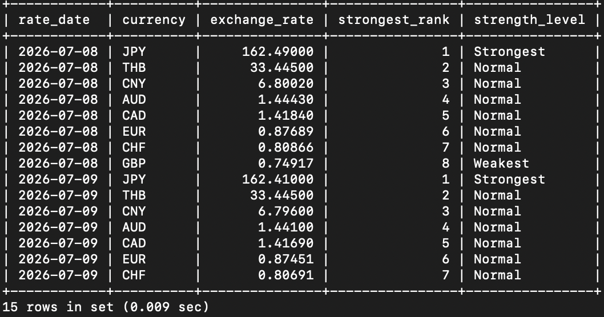

# Currency Exchange ETL Pipeline


A complete ETL (Extract, Transform, Load) pipeline that collects foreign exchange rates from the [Frankfurter API](https://www.frankfurter.app/), validates and transforms the data, stores it in MySQL, and provides SQL analytics for exchange-rate analysis.

The project demonstrates practical data engineering concepts including **ETL architecture, data validation, idempotent loading, historical backfill, containerization, automated testing, and SQL analytics**.

---

## Project Overview

This project demonstrates a complete ETL workflow built with Python and MySQL for collecting, validating, storing, and analyzing foreign exchange rate data.

The pipeline performs the following tasks:

1. Extracts exchange rate data from the Frankfurter API
2. Stores the raw API response as JSON
3. Transforms the raw JSON into a clean tabular format
4. Validates data quality
5. Loads validated records into MySQL
6. Prevents duplicate records through idempotent loading
7. Supports historical data backfill
8. Provides SQL analytics for reporting and analysis
9. Runs locally using Docker Compose
10. Automatically runs unit tests through GitHub Actions

> **Note:** Frankfurter provides exchange rate data based on available European Central Bank reference rates. Exchange rates may not be updated on weekends or certain holidays. When no new rate is available, the API may return the most recent available business-day rate.

---

## Features

- Daily exchange rate extraction
- Historical backfill support
- JSON → CSV transformation
- Data quality validation
  - Missing values
  - Duplicate rows
  - Invalid exchange rates
- MySQL integration
- SQLAlchemy database connectivity
- Idempotent data loading
- Duplicate prevention
- Dockerized ETL application
- MySQL container with persistent volume
- SQL analytics queries
- Automated unit testing with pytest
- GitHub Actions continuous integration
- Logging
- Clean separation of Extract, Transform, Validation, and Load components

---

## Architecture Diagram

<p align="left">
   </p>

---

## ETL Workflow

```text
Frankfurter API
        │
        ▼
     Extract
        │
        ▼
    Raw JSON
        │
        ▼
    Transform
        │
        ▼
    Clean CSV
        │
        ▼
   Validation
        │
        ▼
      MySQL
        │
        ▼
 SQL Analytics
```

---

## Docker Architecture

The project can be run locally using Docker Compose.

```text
                Docker Compose
                      │
          ┌───────────┴───────────┐
          │                       │
          ▼                       ▼
   ┌─────────────┐        ┌─────────────┐
   │ ETL App     │        │ MySQL 8.0   │
   │ Python 3.11 │───────▶│ Database    │
   └─────────────┘        └──────┬──────┘
                                 │
                                 ▼
                          Persistent Volume
                            mysql_data
```
The ETL container waits for MySQL to become healthy before starting the pipeline.

The ETL container is designed as a batch job and exits with code `0` after successfully completing the pipeline.

---

## Tech Stack

### Programming Language

- Python 3.11

### Libraries

- pandas
- requests
- SQLAlchemy
- PyMySQL
- python-dotenv
- pytest

### Database

- MySQL 8.0

### Containerization
- Docker
- Docker Compose

### CI
- GitHub Actions

### Concepts

- ETL Pipeline
- Data Extraction
- Data Transformation
- Data Validation
- Data Cleaning
- Idempotent Data Loading
- Historical Backfill
- SQL Analytics
- Window Functions
- Aggregation
- Data Quality Testing
- Containerization
- Continuous Integration

--- 

## Data Source

Exchange rates are retrieved from the `Frankfurter API`.

- Base currency: USD
- Target currencies: THB, EUR, JPY, GBP, AUD, CAD, CHF, CNY

The API may not publish a new exchange rate every calendar day. For example, weekends and certain holidays may not have a new reference rate.

In those cases, the API can return the latest available rate from a previous business day.

The pipeline preserves the actual date returned by the API rather than incorrectly assigning the current calendar date to the exchange rate.

---

## Data Quality Validation

Before loading data into MySQL, the pipeline performs validation checks.

### Missing Values
Ensures required fields contain no missing values.

### Duplicate Rows
Checks for duplicate exchange-rate records.

### Invalid Exchange Rates
Ensures exchange rates are valid positive numeric values.
Example validation output:

```bash
Step 3 : Validation

✓ No missing values
✓ No duplicate rows
✓ All exchange rates are valid
```

---

## Idempotent Loading

The Load stage prevents duplicate records from being inserted into MySQL.

If the exchange rate for a specific date already exists, the pipeline skips the load.

Example:

```bash
Step 4 : Load

✓ Database schema created
✓ Exchange rates for 2026-08-21 already exist.
Skipping load.
```

This allows the pipeline to be safely executed multiple times without creating duplicate records.

---

## Historical Backfill

The project supports loading historical exchange-rate data.

Example:
```bash
python -m python.backfill.backfill --days 7
```
This allows the pipeline to populate historical dates instead of only processing the latest available rate.

Because the source may not publish rates on weekends or holidays, historical processing uses the actual date returned by the API.

---

## Testing

The project uses `pytest` for automated unit testing.
Current test coverage includes:
* Extract functionality
* Transform functionality
* Validation logic
* Database load logic

Run tests locally:
```bash
pytest
```
Example:
<p align="left">
   </p>

---

## Continuous Integration

GitHub Actions automatically runs the test suite whenever changes are pushed to `main` or a pull request is opened against `main`.

Workflow:

```text
GitHub Push / Pull Request
          │
          ▼
   Checkout Repository
          │
          ▼
   Setup Python 3.11
          │
          ▼
   Install Dependencies
          │
          ▼
        pytest
          │
      ┌───┴───┐
      ▼       ▼
    Pass     Fail
```

Workflow file: `.github/workflows/tests.yml`

---

## Project Structure

```text
currency-exchange-etl-pipeline/
│
├── .github/
│   └── workflows/
│       └── tests.yml
│
├── data/
│   ├── raw/
│   └── clean/
│
├── docs/
│   └── images/
│       └── architecture_currency_exchange_etl_pipeline.png
│
├── logs/
│
├── python/
│   ├── extract/
│   │   └── extract_data.py
│   │
│   ├── transform/
│   │   └── transform_data.py
│   │
│   ├── validation/
│   │
│   ├── load/
│   │   └── load_to_mysql.py
│   │
│   ├── backfill/
│   │
│   ├── utils/
│   │   └── config.py
│   │
│   └── main.py
│
├── sql/
│   ├── schema.sql
│   │
│   └── analytics/
│       ├── 01_currency_strength.sql
│       ├── 02_daily_summary.sql
│       ├── 03_rate_changes.sql
│       ├── 04_cross_currency.sql
│       ├── 05_currency_volatility.sql
│       └── 06_currency_ranking.sql
│
├── tests/
│   ├── test_extract.py
│   ├── test_transform.py
│   ├── test_validation.py
│   └── test_load.py
│
├── .env
├── .gitignore
├── Dockerfile
├── docker-compose.yml
├── requirements.txt
├── README.md
└── LICENSE
```

---

## Installation

1. Clone the repository.

```bash
git clone <repository-url>

cd currency-exchange-etl-pipeline
```

2. Create a virtual environment.

```bash
python -m venv .venv
```

Activate it.

```bash
source .venv/bin/activate
```

3. Install dependencies.

```bash
pip install -r requirements.txt
```

---

## Environment Variables

Create a `.env` file:

```text
DB_HOST=localhost
DB_PORT=3306
DB_NAME=currency_exchange
DB_USER=root
DB_PASSWORD=your_password
```

When running the ETL application inside Docker Compose, the application connects to the MySQL service using the Docker service name `mysql` rather than `localhost`.

---

## Running Locally

Run the latest ETL pipeline:
```bash
python -m python.main
```
Expected workflow:

<p align="left">
   </p>

## Running with Docker

Build the application image:
```bash
docker compose build
```

Start the services:
```bash
docker compose up
```
Docker Compose starts:

- ETL application
- MySQL 8.0

MySQL is exposed locally on port `3307`:
`localhost:3307 → MySQL container:3306`

The MySQL database uses a persistent Docker volume:
`currency-exchange-etl-pipeline_mysql_data`

This ensures database data persists when containers are stopped or recreated.

---

## Checking Containers

View running containers:
```bash
docker compose ps
```

Example:
```bash
NAME                      SERVICE   STATUS
currency-exchange-mysql   mysql     Up (healthy)
```
The ETL container exits with code `0` after successfully completing the pipeline because it is designed as a batch ETL job rather than a continuously running service.

---

## Accessing MySQL

Connect to the MySQL container:
```bash
docker exec -it currency-exchange-mysql \
mysql -u root -proot currency_exchange
```

Check loaded records:
```bash
SELECT COUNT(*)
FROM exchange_rates;
```

View exchange rates:
```bash
SELECT *
FROM exchange_rates
ORDER BY rate_date DESC, target_currency;
```

---

## Running SQL Analytics

The analytics queries are located in: `sql/analytics/`
The SQL files include:

- Currency strength statistics
- Daily summaries
- Rate changes
- Cross-currency calculations
- Currency rate dispersion
- Daily rate ranking

When using MySQL inside Docker, the SQL files must be available inside the container or executed from the local environment against the exposed MySQL port.

For example, connect from the host:
```bash
mysql -h 127.0.0.1 -P 3307 -u root -proot currency_exchange
```
Then run the desired SQL query.

---

## Business Questions

The ETL pipeline and SQL analytics are designed to answer business-oriented questions such as:

- Which currency has the highest average exchange-rate value over the available observations?
- Which currency has the greatest rate dispersion?
- How does each currency change compared with its previous available observation?
- What is the daily spread between the highest and lowest exchange-rate values?
- How can cross-currency rates such as THB → EUR be calculated?
- Which currencies have the highest and lowest exchange-rate values on each available date?

---

## SQL Analytics

The project contains analytical SQL queries that demonstrate aggregation, window functions, ranking, volatility analysis, and cross-currency calculations.

| File | Description |
|------|-------------|
| `01_currency_strength.sql` | Average, minimum, and maximum exchange rates |
| `02_daily_summary.sql` | Daily exchange-rate summary |
| `03_rate_changes.sql` | Changes from the previous available observation using `LAG()` |
| `04_cross_currency.sql` | Cross-currency exchange calculations |
| `05_currency_volatility.sql` | Exchange-rate dispersion using `STDDEV()` |
| `06_currency_ranking.sql` | Daily exchange-rate ranking using SQL window functions |

---

## Example Output

### ETL Pipeline

Example execution of the ETL pipeline, showing each stage from data extraction to loading into MySQL with validation checks.

<p align="left">
   </p>

### MySQL Database

Sample records loaded into the `exchange_rates` table after the ETL process has completed successfully.

<p align="left">
   </p>

### SQL Result Example (Daily Summary)

Example analytical query showing a daily exchange rate summary generated from the loaded dataset.

<p align="left">
   </p>

---

## SQL Analytics Examples

### 01 Currency Strength

Calculates the average, minimum, and maximum exchange rate for each currency across the available observations.

<p align="left">
   </p>

---

### 02 Daily Summary

Provides a daily overview of exchange rate statistics, including average, minimum, maximum, and daily spread.

<p align="left">
   </p>

---

### 03 Rate Changes

Calculates changes from the previous available observation and percentage changes using the `LAG()` window function.

**Note**: Only EUR results are shown for readability.

<p align="left">
   </p>

---

### 04 Cross Currency

Computes the **THB → EUR** cross exchange rate using USD as the common base currency by joining exchange rates from the same date.

<p align="left">
   </p>

---

### 05 Currency Volatility

Measures exchange-rate dispersion for each currency using the standard deviation (`STDDEV()`).

<p align="left">
   </p>

---

### 06 Currency Ranking

Ranks currencies by exchange-rate value for each available date and classifies them as **Highest Rate**, **Lowest Rate**, or **Normal** using SQL window functions.

**Note**: Only the first 15 rows are shown for readability.

<p align="left">
  
</p>

---

## Key Data Engineering Concepts Demonstrated

This project demonstrates several practical data engineering concepts:

- Extract: Retrieving data from an external REST API.
- Transform: Converting nested/raw API responses into structured tabular data.
- Validate: Applying data-quality checks before loading data into the database.
- Load: Persisting validated records into a relational database.
- Idempotency: Preventing duplicate records when the pipeline is executed repeatedly.
- Historical Backfill: Processing previously available exchange-rate dates.
- Containerization: Packaging the ETL application and database using Docker Compose.
- Automated Testing: Using pytest and GitHub Actions to detect regressions automatically.
- SQL Analytics: Applying
              - Aggregations
              - CTEs
              - Window Functions
              - `LAG()`
              - `ROW_NUMBER()`
              - `STDDEV()`
              - Cross-currency calculations

---

## Future Improvements

Potential future improvements include:

- Scheduling automated daily ETL execution
- Adding an orchestration tool such as Apache Airflow
- Adding monitoring and alerting
- Expanding data-quality checks
- Adding more currencies
- Adding visualization dashboards
- Adding integration tests against a temporary MySQL database
- Deploying the pipeline to a cloud environment

---

## License

This project is licensed under the MIT License.